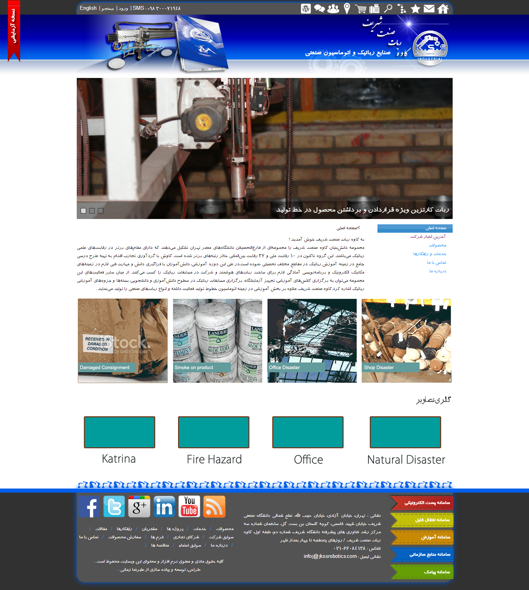

**Project Title**
# KSS - Corporate Website UI Design

**Project Type**
Front-End Development

**Project Status:** Finished, Offline
**Project Date:** September 2013

**Project Description**
KSS Robotics Co ([http://sati.sharif.ir/unit-detail.jsp?id=192](http://sati.sharif.ir/unit-detail.jsp?id=192)) is one of iranian knowledge based companies that is active in the design and implementation of industrial robots. In this project I've designed the user interface of their website. It is open source and you can download it:

Download Design Source (~67 MB) : [http://www.AliZamani.net/files/kss-Design Source.rar](http://www.AliZamani.net/files/kss-Design Source.rar)

**Client**
KSS Robotics Industries & Automation Co. Ltd ([http://sati.sharif.ir/unit-detail.jsp?id=192](http://sati.sharif.ir/unit-detail.jsp?id=192))

**Project Specifications**
* HTML5 / CSS3 / Javascript
* JQuery
* Adobe Photoshop 
* Web Fonts
* Paper Based Wireframing

Visit My Official Website : [http://www.AliZamani.net](http://www.AliZamani.net)

**Screenshots**
Download Screenshots (~20 MB) : [http://www.AliZamani.net/files/kss-Screenshots.rar](http://www.AliZamani.net/files/kss-Screenshots.rar)
# Home Page Screenshot :
